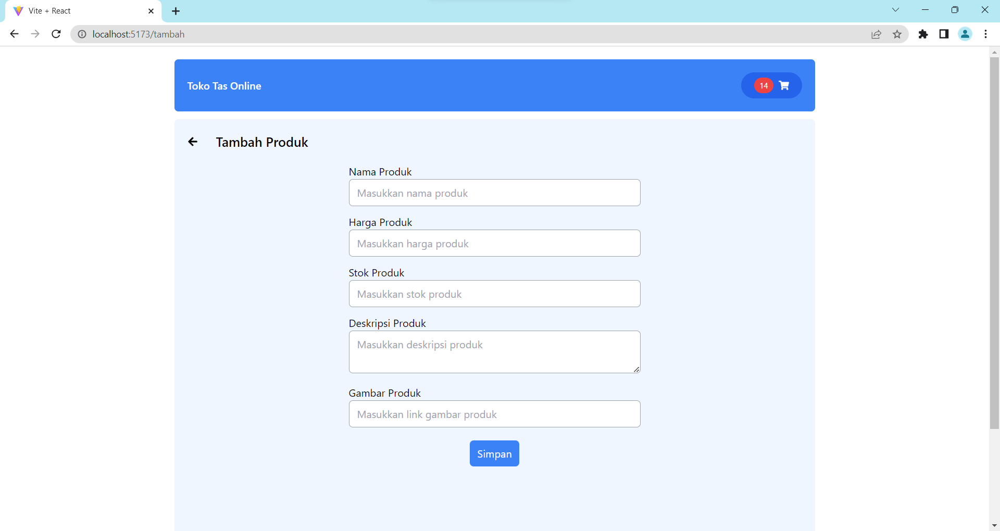
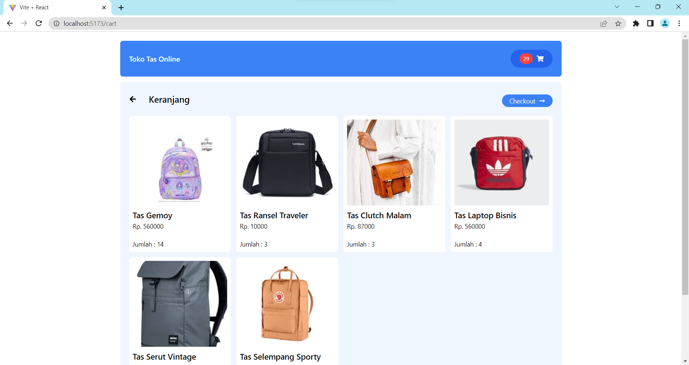

# UTS 120140072 FRONTEND

## Cara menjalankan

1. Buka terminal
2. clone repository ini `git clone https://github.com/michellenstt/120140072_uts_pwl_frontend`
3. masuk ke folder project `cd 120140072_uts_pwl_frontend`
4. install dependencies `npm install`
5. jalankan server `npm run dev`
6. buka browser dan akses `http://localhost:5173/`

## Screenshots

1. Beranda
   

2. Detail
   

3. Tambah
   

4. Edit
   

5. Hapus
   
   
   

6. Keranjang
   

7. Hitung Harga
   
